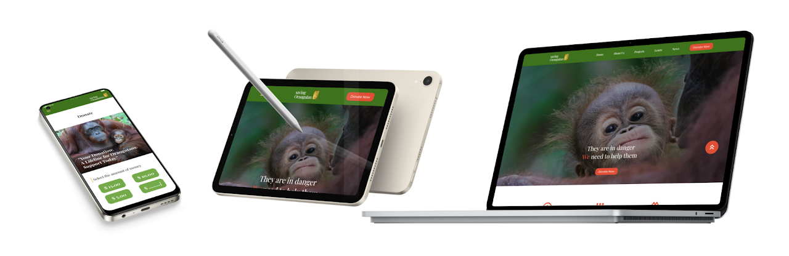
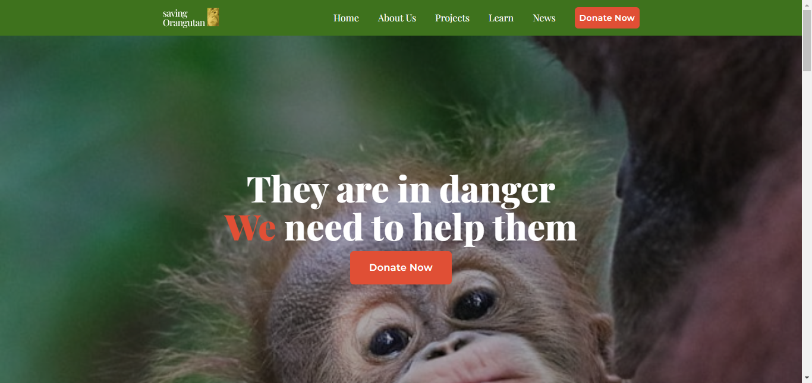
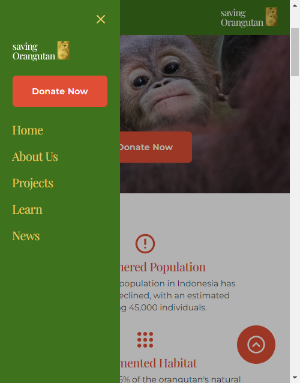

# SavingOrangutan

SavingOrangutan is a website I made to test my skill on Typescript and Tailwind CSS. The design of this website came from my UX Google Design course.

SavingOrangutan website just a mockup and it don't have fully functionality donation page. Only for display.

## Tech Stack

**Client:** TypeScript, React, TailwindCSS

## Features

-   Responsive design
-   Go to top button (on smaller screen devices)
-   Single Page Application (SPA)## Color Reference

| Color          | Hex                                                              |
| -------------- | ---------------------------------------------------------------- |
| Primary Green  |  #3E721D |
| Primary Yellow |  #E6CA66 |
| Primary Red    |  #E04F35 |
| Primary Black  |  #333333 |

## Screenshots

## Lessons Learned

Trying to use react components to prevent DRY code.
I learn how to transform a design into a website with mobile-first approach principle.

You can see the design process by clicking this [link](https://sites.google.com/view/jhontriboyke/savingorangutan?authuser=0)

## Demo

[Live Site](https://savingorangutan-jhontriboyke.netlify.app/)

[Figma Prototype](https://www.figma.com/proto/VI2MIKFOea06AsTst3MKIA/new-savingorangutan-project?type=design&node-id=53-17&t=3GzET0QlKbv8lbko-0&scaling=scale-down-width&page-id=45%3A641&starting-point-node-id=53%3A17&hide-ui=1)

## Authors

-   [Personal Website](https://www.jhontriboyke.site)
-   [Instagram](https://www.instagram.com/jhontriboyke/)
-   [LinkedIn](https://www.linkedin.com/in/jhontri-boyke-0a9158258/)
-   [Frontend Mentor](https://www.frontendmentor.io/profile/jhontriboyke)
